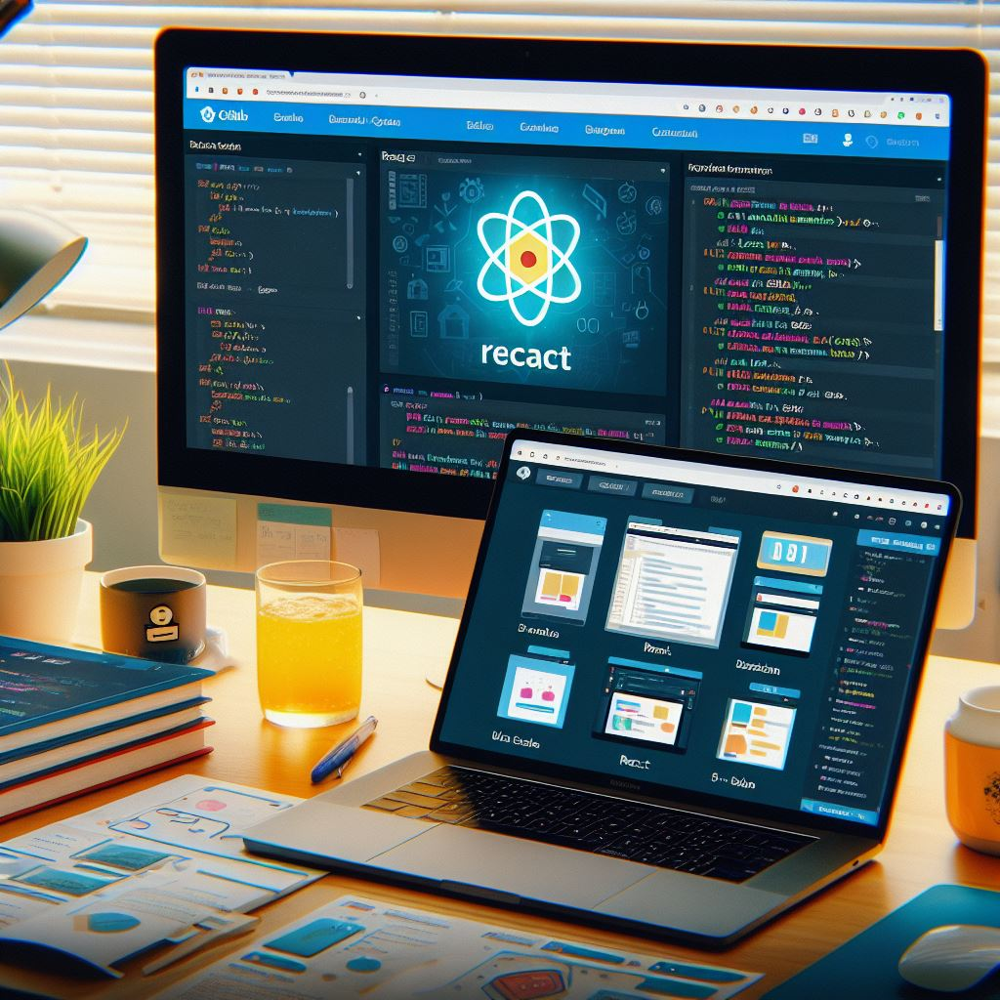

<dv align="center">

# Curso REACT 2024
<<<<<<< HEAD
</div>
=======

</center>
>>>>>>> b67653ea6e8f5ddbc0a6899bef8573790404bce4

<p align="center">
  
</p>

Curso REACT 2024 Desarrollo de Aplicaciones WEB

🚧🚧🚧🚧 En contrucción 🚧🚧🚧🚧


## Instalación

Sigue estos pasos para configurar tu entorno de desarrollo con Vite y comenzar con el curso.

### 1. Requisitos Previos

Asegúrate de tener Node.js y npm instalados en tu máquina. Puedes descargarlos desde [https://nodejs.org/](https://nodejs.org/).

### 2. Clonar el Repositorio

```bash
git clone https://github.com/tuusuario/curso-react-2024.git
cd curso-react-2024
npm install
npm run dev
```

Esto iniciará el servidor de desarrollo en http://localhost:3000. Abre esta URL en tu navegador para ver la aplicación en acción.

## Contenido del Curso

- Introducción
- 


## Recursos Adicionales

- [Documentación oficial de React](https://es.react.dev/)
- [Documentación oficial de Vite](https://vitejs.dev/guide/)
